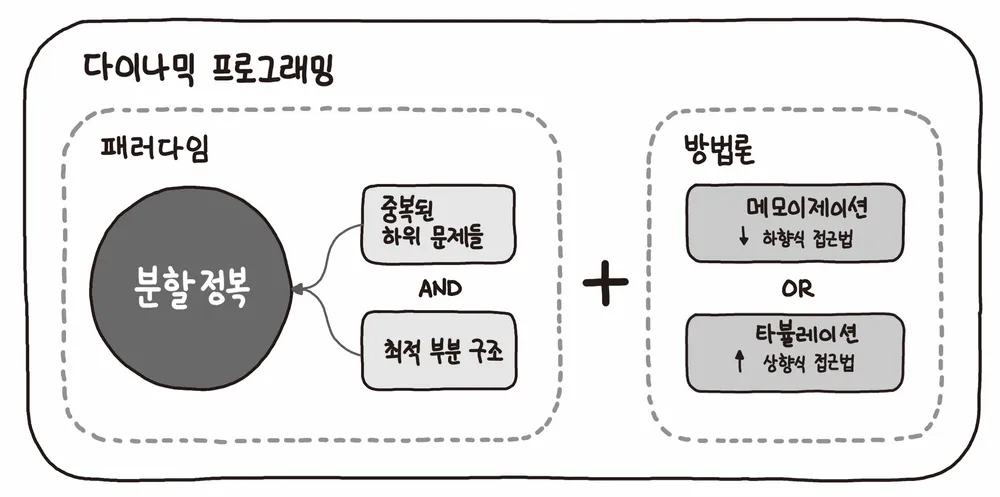
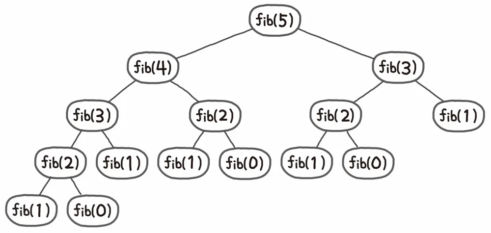

# 동적 프로그래밍(Dynamic Programming)
> 동적 프로그래밍이란?
    - 최적화 이론의 한 기술, 특정 범위 값을 구하기위해 다른 범위까지의 값을
    이용하여 효율적으로 값을 구하는 알고리즘 설계 기법
>> 즉 답을 재활용한다는 느낌이다!!      



* 주어진 문제를 부분 문제로 나누어 각 부분 문제의 답을 계산 
* 그 결과값으로 원래 문제의 답을 산출 

## 예시) 피보나치 수열

* 피보나치 수열은 재귀형태로 표현
```kotlin
f(0) = 1
f(1) = 1
f(n) = f(n-1) + f(n-2) when n > 1
```
코드로 풀어보면,
```kotlin
fun fibo(n :Int):Int{
    if(n<=1) return 1
    return fibo(n-1) + fibo(n-2)
}
```
함수가 호출되면, 메모리의 Stack 에 데이터가 쌓으므로 fibo(5)의 경우, 총 15번의 함수 호출이 발생한다...



이 경우, n의 크기가 증가하면 증가할수록 시간,공간 복잡도가 기하급수적 으로 증가하기 떄문에 효율적인 알고리즘이라고 볼 수 없다.
 ### 이로 인해 ' 이미 구했던 값들을 이용하여 재활용하자 ' 가 동적 프로그래밍의 접근 방식이다.   


* 동적 계획법의 피보나치 수열
```kotlin
const val SIZE = 1000
fun main(){

    var memo = Array<Int>(SIZE,{0})//값들을 저장
    
    fun fibo(n:Int):Int{

        if(n<=1) return n 
        //fibo(0)=fibo(1)= 1

        if(memo[n]!=0) return memo[n]
        //n값이 포함 되어 있다면 리턴

        memo[n] = fibo(n-1) + fibo(n-2)
        // 작은 문제로 분할
        return memo[n]

    }
}

}


```
> 값이 저장되어 있으면 , 위의 그림같이, 뿌리(맨 아래층)에 갈 필요없이 바로 배열값만 불려들이면되서 시간 복잡도가 크게 줄어든다.

## 이외의 예제들
1. 3항 이상의 재귀 수열
2. 0-1 배낭 문제
3. 가장 긴 증가 수열 문제
4. 연쇄 행렬 곱셈문제
5. 그래프 상의 최단거리 문제
>나중에 참고하자!!

출처 : https://namu.wiki/w/%EB%8F%99%EC%A0%81%20%EA%B3%84%ED%9A%8D%EB%B2%95


# 결론
내 기준으로 효율적으로 짜는 방식의 새로운 접근 이었다.
기존에는 자료구조를 중요시했는데 각각 접근방식이 다를 수 있다는걸 알았다..

>알고리즘 한 문제 푸는데 매니져님이 왜 30분이상 잡지말라는 이유를 알 것 같다. 막상 푼다해도 이런 기법을 갑자기 문득 떠오르기도 힘들고, 무지성 으로 들어박는 방식으로 공부하는건 오히려 독인거 같다.